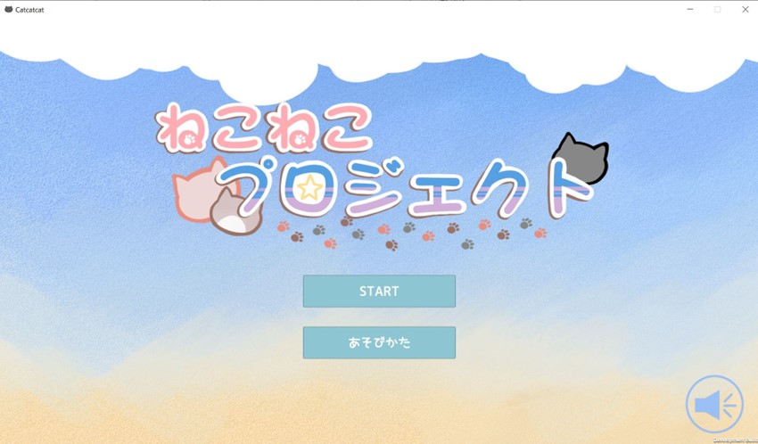
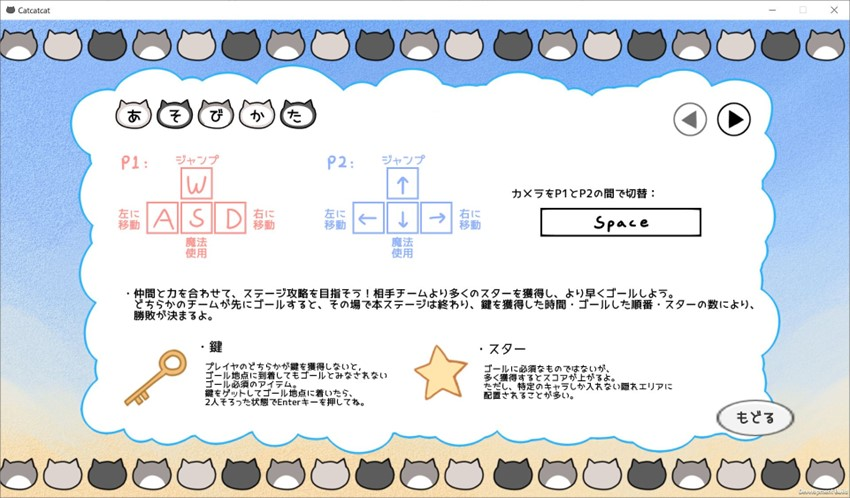
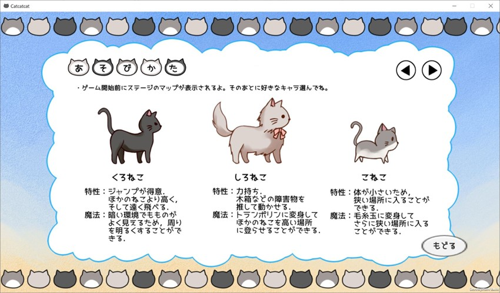
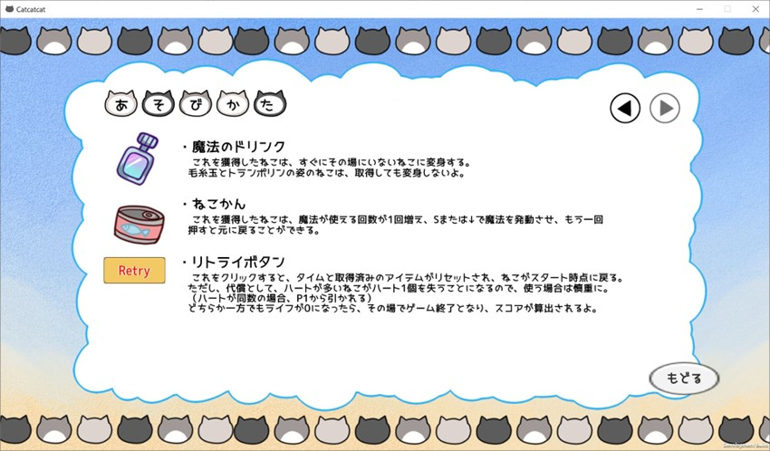
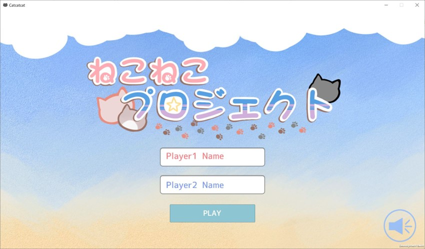
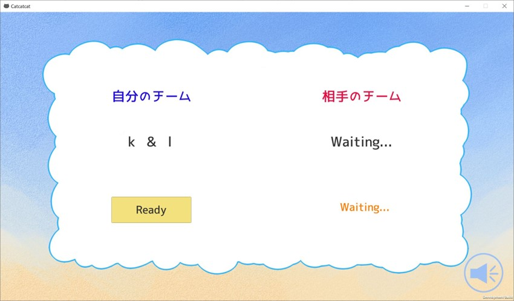
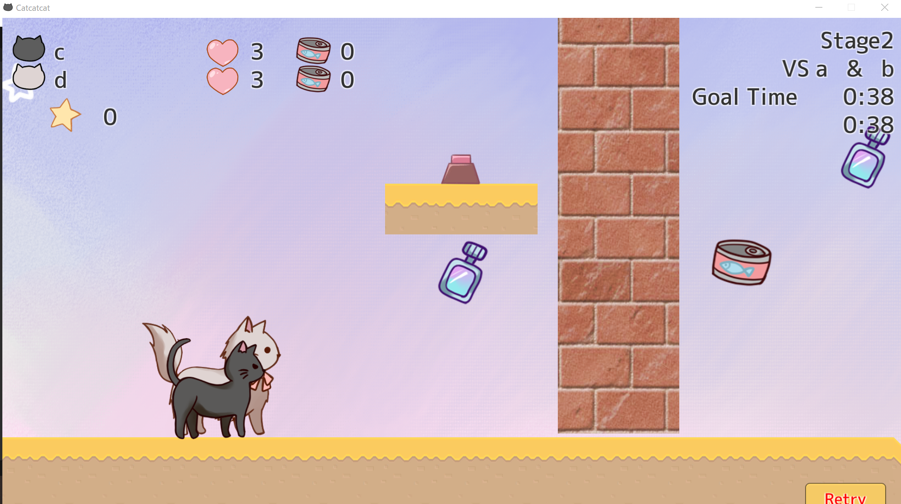
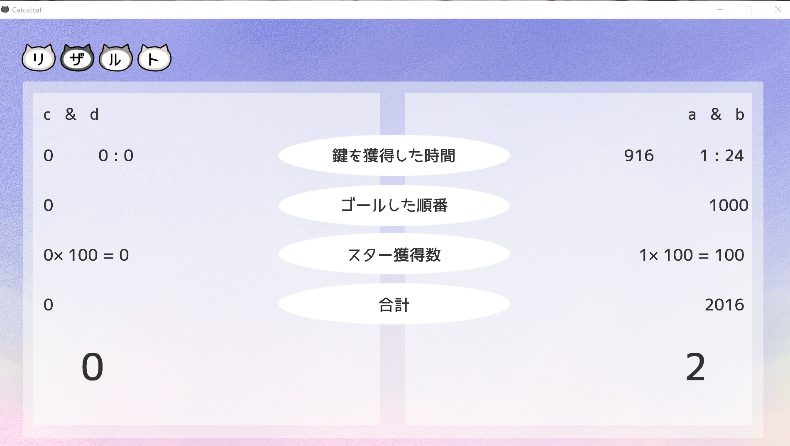
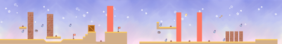

# CatCatProject
謎解き！ねこねこプロジェクト

## 特長
* 二人で一つのデバイスを操作：身近でプレイすることで攻略の相談が可能
* ネットワーク対戦機能：Photon Unity Network 2で実装
* グラフィック：イラストはすべて自作＆動きを付けることによって本格的なゲームを再現

## 制作時期
2021年6月-7月

## OS
Windows 10, Linux x86_64

## 開発環境
Unity 2020.3.10f1

## プレイ画面
タイトル画面：

遊び方：

ログイン画面 

 

部屋を作成する 

 

マッチング画面 

 

プレイ中 

 

リザルト画面 

 

マップ構成 

 
