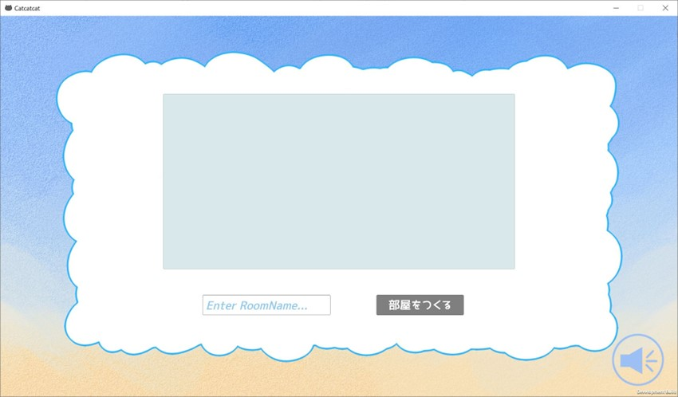

# CatCatProject
謎解き！ねこねこプロジェクト

## 特長
二人で一つのデバイスを操作：身近でプレイすることで攻略の相談が可能
ネットワーク対戦機能：Photon Unity Network 2で実装
グラフィック：イラストはすべて自作＆動きを付けることによって本格的なゲームを再現

## 制作時期
2021年6月-7月

## OS
Windows 10, Linux x86_64

## 開発環境
Unity 2020.3.10f1

## プレイ画面
タイトル画面：

遊び方：

ログイン画面:

部屋を作成する：

マッチング画面

プレイ中：

リザルト画面：

マップ構成：
